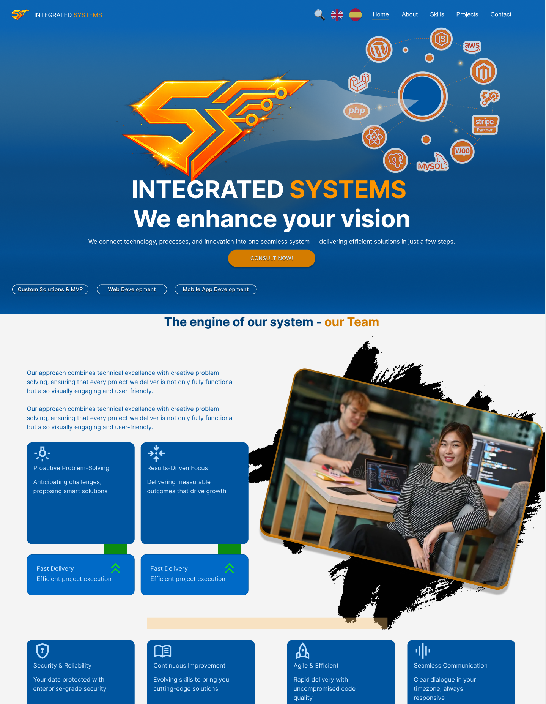
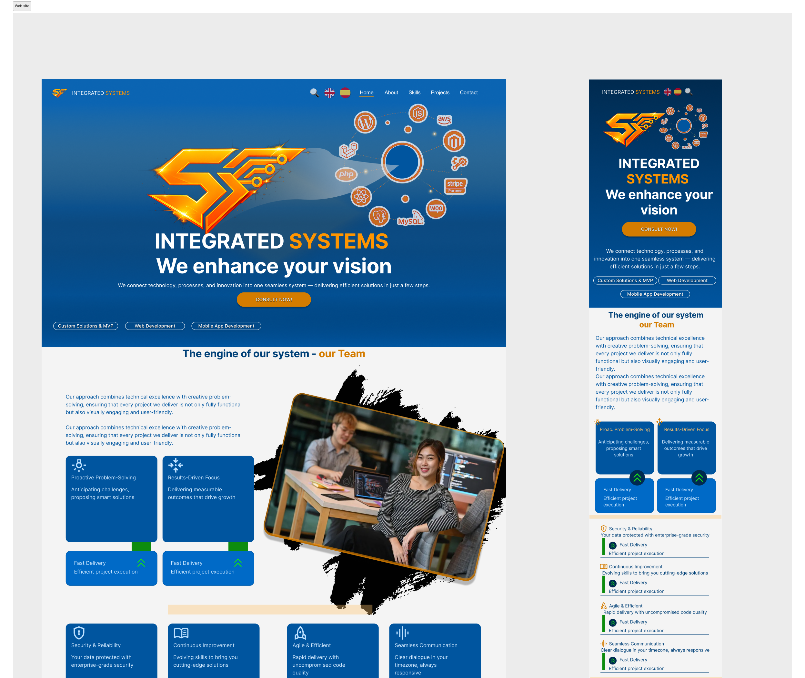
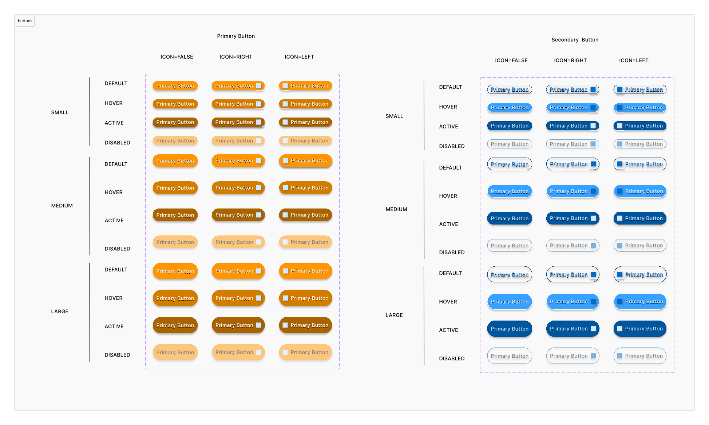
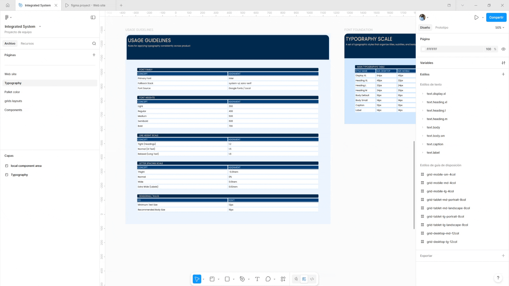
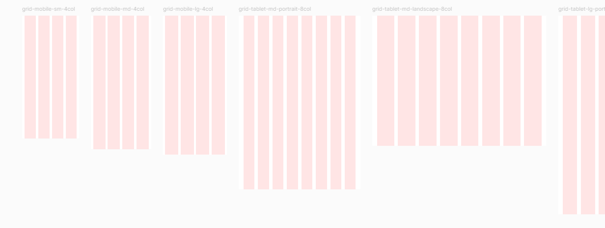

# Figma Project (Integrated Systems — UI Design System and Homepage)

This project simulates the design of a technology services company website
focused on communicating complex technical services in a clear and structured way.

link to figma visor: [ver el proyecto](https://www.figma.com/design/ByKaJxeXdEbS2O75fC3cZg/Integrated-System?node-id=37-4545&t=JeSay5HQ0ccqlj6F-1)

It is also available in this repository; you will find it as `integrated_system.fig` to open it locally.

At the start of the project, I noticed that managing and updating colors within Figma's palette and variable system (especially for later use in components) was somewhat cumbersome.

Therefore, I decided to simplify the workflow by creating a color palette generator plugin to streamline loading and updating colors. I love it when these little challenges come up!

You can use it too if you'd like!

---

## Table of Contents

- [Project Scenario](#project-scenario)
- [Design Decisions](#design-decisions)
    - [Color System](#color-system)
    - [Layout Structure](#layout-structure)
    - [Component-Based Design](#component-based-design)
    - [Grid and Spacing System](#grid-and-spacing-system)
- [UX Principles Applied](#ux-principles-applied)
    - [Visual Hierarchy](#visual-hierarchy)
    - [Clarity and Readability](#clarity-and-readability)
    - [Consistency](#consistency)
    - [Conversion-Oriented Design](#conversion-oriented-design)
- [Design Process](#design-process)
    - [Research](#research)
    - [Ideation](#ideation)
    - [Solution](#solution)
- [Plugin](#plugin)
    - [Color Palette Generator](#color-palette-generator)
    - [Problem Identified](#problem-identified)
    - [How It Works](#how-it-works)
    - [Impact](#impact)
- [Project Structure (Figma Pages)](#project-structure-figma-pages)
    - [Website](#website)
    - [Components](#components)
    - [Color Palette](#color-palette)
    - [Typography](#typography)
    - [Grid and Layout System](#grid-and-layout-system)
- [Author](#author)

---

## Project scenario

This project simulates the design of a technology services company website
focused on communicating complex technical services in a clear and structured way.

**The main challenge was to design a homepage capable of**:

- Presenting multiple technical services clearly
- Communicating trust and professionalism
- Guiding users toward conversion actions
- Creating a scalable visual system for future growth
- Maintaining consistency across responsive layouts

The project also aimed to establish a reusable design system to support
long-term scalability and efficient UI development.

**Target**

- Target users include business owners and organizations seeking
- software development and technology solutions who need clear
- information about services, process, and value proposition.

---

## Design Decisions

### Color System

A blue-based color palette was selected to communicate trust,
technology, and reliability. Orange was introduced as an accent
color to highlight calls to action and guide user attention
through key interaction points.

A token-based color system was implemented to ensure consistency
and scalability across components.

### Layout Structure

The homepage follows a clear content hierarchy:

- Main section with value proposition and call to action
- Team introduction
- Services, solutions, and call to action sections
- Social proof (testimonials)
- Final conversion section
- Work process explanation
- Corporate Footer

This structure was designed to progressively build trust
and guide users toward action.

### Component-Based Design

Reusable UI components were created to:

- Ensure consistency
- Reduce design complexity
- Support scalability
- Enable faster iteration

Cards were used extensively to organize information into
clear and digestible sections.

### Grid and Spacing System

A structured grid system was implemented to maintain alignment,
visual balance, and predictable layout behavior across devices.
Different breakpoints were defined for desktop, tablet, and mobile
to support responsive design.

---

## UX Principles Applied

### Visual Hierarchy

Content is structured to guide the user's attention from the
main value proposition to supporting information and finally
to conversion actions.

### Clarity and Readability

Typography scales, spacing rules, and content grouping were
designed to improve readability and reduce cognitive load.

### Consistency

A unified design system with reusable components, color tokens,
and typography rules ensures consistent user experience.

### Conversion-Oriented Design

Strategic placement of calls to action and progressive information
disclosure help guide users through a clear conversion path.

---

## Design Process

### Research

The project started by analyzing technology service websites
to understand common layout patterns, visual language,
and content structure.

The following companies were analyzed as industry references:

https://www.serfe.com/en/
https://www.bairesdev.com/

Key observations:

- Strong visual hierarchy is required to communicate complex services
- Clear value proposition in the hero section
- Modular service presentation
- Trust-building elements (testimonials, process explanation)
- Multiple call to action, strategically placed.

### Ideation

Wireframes were created to explore:

- Information hierarchy
- Layout structure
- Component organization
- Conversion flow

A component-based approach was selected to support scalability
and maintain consistency across the interface.

### Solution

The final solution includes:

- A structured homepage layout
- A reusable design system
- Token-based color and typography system
- Responsive grid structure
- Custom plugin to automate color token generation

---

## Plugin

The plugin was developed to optimize the design workflow
and reduce manual effort when managing color tokens.

### Color Palette Generator

A custom plugin built for Figma that automates the creation of
color scales and design tokens for a structured design system.

The plugin generates a complete color scale from a base color,
creates Figma variables, binds them to UI components, and updates
design tokens automatically.

It was created to reduce manual work, ensure consistency,
and improve scalability in the design process.

### Problem identified

Creating consistent color scales manually is time-consuming and
error-prone. Designers often need to:

- Generate multiple shades from a base color
- Maintain naming conventions
- Update UI components manually

This plugin automates the entire process by generating structured
color scales and binding them directly to design components.

### How It Works

The plugin follows a structured workflow:

1. The user selects a "Palette color" component.
2. A base color is provided via color picker or HEX input.
3. The plugin generates a full color scale (50–900).
4. A variable collection is created or updated.
5. Color variables are bound to UI components automatically.
6. The component preview and token values are updated.

### Impact

- Reduces manual color scale creation time
- Improves design system consistency
- Prevents naming inconsistencies
- Enables scalable token management
- Automates repetitive design tasks

---

## Project Structure (Figma Pages)

The Figma project is organized into several sections:

### Website

Here you will find the complete structural design of the homepage for both desktop and mobile devices:

### Components

This section contains the library of reusable components:

- Cards
- Buttons
- Layout Blocks
- Service Containers
- Modular UI Elements

### Color Palette

Here you can explore the token-based color system:

- **Primary** → main brand color
- **Secondary** → supporting color
- **Error** → error states
- **Success** → positive states
- **Neutral** → backgrounds, text, and base structure as needed

Each color includes multiple intensity variations for different usage contexts.

### Typography

This section defines the typographic system, including:

- Heading hierarchies
- Size scales
- Font weights
- Use of components
- Line height and spacing

### Grid and Layout System

The project also includes a grid and layout system that defines:

- Adaptive structure
- Spacing rules
- Content distribution
- Element alignment
- Visual organization

The most commonly used sizes were analyzed:

**Desktop**

- grid-desktop-lg-12col — 1728 width × scalable height
- grid-desktop-md-12col — 1440 width × scalable height

**Tablet**

- grid-tablet-lg-landscape-8col — 1366 width × scalable height
- grid-tablet-lg-portrait-8col — 1024 width × scalable height
- grid-tablet-md-landscape-8col — 1194 width × scalable height
- grid-tablet-md-portrait-8col — 834 width × scalable height

**Mobile**

- grid-mobile-lg-4col — 440 width × scalable height
- grid-mobile-md-4col — 412 width × scalable height
- grid-mobile-sm-4col — 390 width × scalable height

---

## Author

Mauro Marucci
